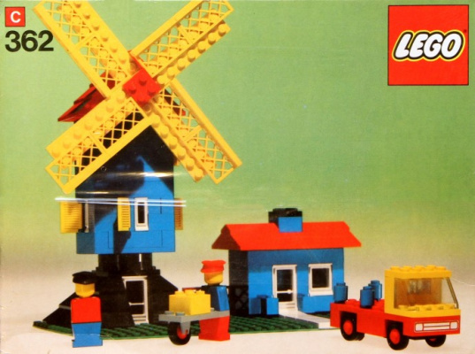
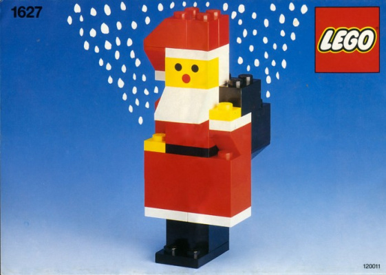
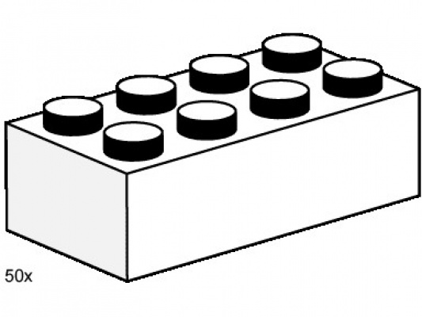
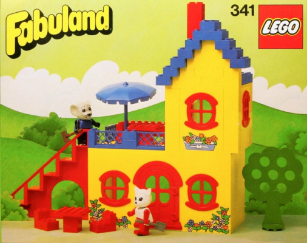
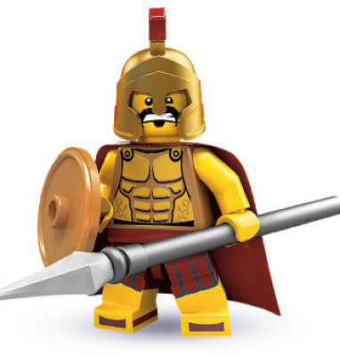
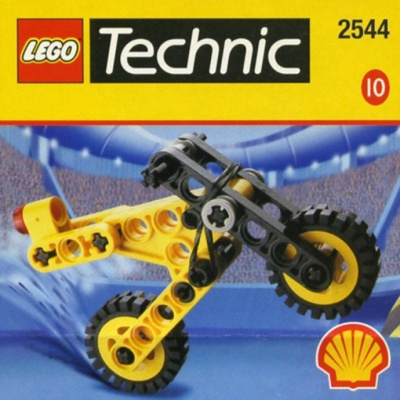
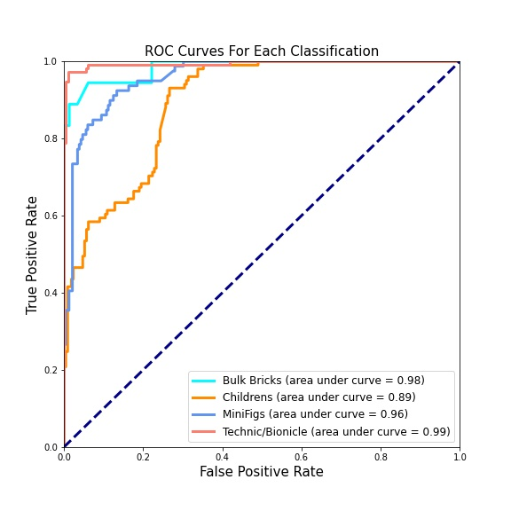
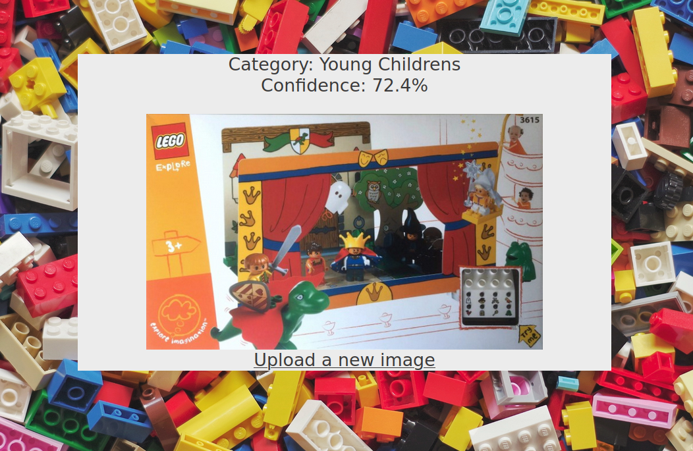

# **Lego Themer**

## **Background**

Lego sets come in a wide variety of themes ranging from Harry Potter to Bioncle. In fact there are over 500 unique Lego themes. The aim of this project is to identify which theme a Lego set belongs to based on the product image. 

---

## **Dataset**
Over 14,000 images were scraped from [BrickInsights](https://brickinsights.com/) by using the URL of thumbnail images provided by thier API. The API returned a JSON file which contained the image URL along with the set ID for each of the sets on the website. This was then paired with data from [Rebrickable](https://rebrickable.com/) to give each image a label. The scraping function ImageScraper.py will do all of this and create directories in the data folder where each subfolder contains only images from a certain theme. 

Images are all 400px tall however the aspect ratio of each image is different which is a problem I will deal with later. There also are major class imbalances where several classes have less than 10 images while others have over 1,000.

---

## **Data Pipeline**
### **Collecting the Data**

As stated above, the data was scraped from [BrickInsights](https://brickinsights.com/)) using the JSON files provided by the API. Over 14,000 images were collected, however, many of those images where lost when it came to cleaning the labels which I'll talk about more in the cleaning section. To gather the images yourself, run the ImageScraper.py file from the directory it is located in.

### **Labeling the Data**

The Rebrickable JSON files also contained the set ID for each set. I was then able to merge these JSON files with data from [Rebrickable](https://rebrickable.com/) by matching the set ID's. The Rebrickable data had the theme labels which I was then able to attach to the images.

### **Cleaning the Labels**

While the labels were all technically correct according to the official Lego documentation, they often times did not make sense or were indistinguishable from each other. Let's look at an example.

The above set looks like it may belong in the Christmas theme or maybe the MiniFigure theme which are both official themes but that is not the case. The actual label of this set is Seasonal. This what a common occurance in the data and to overcome this I chose to group images into the most distinct themes I could. The result were the following themes:

#### **Bulk Bricks**

These are parts packs that are often just all one style of brick. 

#### **Young Childrens**

These are sets specifically marketed towards younger children. They often have larger pieces to make it easier for young children to play with and prevent choking hazards.

#### **MiniFig**

These are figures rather than entire sets. The are often just the standard Lego person figure with costume pieces on it.

#### **Technic/Bionicle**

These are sets which a very different style of pieces. They often are not made with standard Lego bricks but rather the tube-like pieces you see in this set.

---

## **Building the Model**

I created a Convolutional Neural Network using Tensorflow with the following structure
|Layer     |Output Shape    | Activation Function| Number of Parameters |
|-----------|-------| ---| ---|
| Convolutional 2d   | (None, 224, 224, 32)   | Relu   | 3488 |
|Max Pooling | (None, 112, 112, 32) |None | 0|
|Convolutional 2d|(None, 112, 112, 32)|Relu|165952|
|Max Pooling | (None, 56, 56, 64)|None| 0|
|Convolutional 2d| (None, 56, 56, 64)|Relu|  36928|
|Flatten| (None, 200704)| None|0|
|Dense | (None, 64)|Relu| 12845120|
|Dropout| (None, 64)|None| 0 |
|Dense| (None, 4)|Softmax| 260|

The loss function I chose was categorical crossentropy and the optimization function used was Adam.

Initially the model only predicted the mean but when I added the dropout layer and lowered the learning rate it significantly improved.

The next problem was that the classes were imbalanced and the model did not ever predict the minority classes. This was improved by using the Tensorflow Image Generator to create more images for the smaller classes.

Finally the model was working but the accuracy was not as high as I had hoped for. By increasing the kernal size on the convolutional layers I was able to significantly improve the performance of the model.

---

## **Model Performance**

To evaluate the model a baseline model was setup that always predicted the mode class. This model performed with 31% accuracy. The CNN model I had built, however, performed with an acuracy of **82%** significantly beating the baseline model.

### **Confusion Matrix**

| | Actual Bulk    |Actual Young Childrens  | Actual MiniFig| Actual Bionic/Technic |
|-----------|-------| ---| ---| ---|
| Predicted Bulk  | **16**   | 0   | 2 | 0 |
|Predicted Young Childrens| 5 | **53**| 32 | 11 |
|Predicted MiniFig| 0 | 4| **75** | 0 |
|Predicted Bionic/Technic| 0 | 2| 0 | **111** |

As you can see most categories performed pretty well. Young Childrens did have a much higher rate of false positives however and you can see that more clearly in the following ROC Curve graph

Note that the area under the curve for Childrens is much lower than the other categories and that the "elbow" of the graph is not as far in the top left corner as the others. This indicates it has a higher rate of false positives than the other classes. 

---

## **Flask Application**

The saved model was then build into a Flask application where users can upload an image and the model will predict the theme of the Lego set. The application be run by going to the src/web_app folder and running init.py

---

## **Future Work**

### **Adding More Themes**
I would like to expand on the project to not only work on the four themes that I have included, but to work a larger number of themes from the Lego franchise.

### **Training Model to Unofficial Images**
Currently the model will only have a strong accuracy when predicting the official Lego product images but if it was trained on images that were uploaded from users it may have more functionality. Users could then upload a picture they took of a Lego set and the model could then predict the theme.

### **Implementing a Pre-Trained Model**
This project was a great exercise in learning the layers and how to improve a Convolutional Neural Network, but there are many more accurate Neural Nets out there. Models such as VGG16 and AlexNet have been highly researched and trained on a large datasets so therefore are much more accurate at identifying objects and assigning them labels. I believe one of these structures would give a much higher accuracy to my model.
